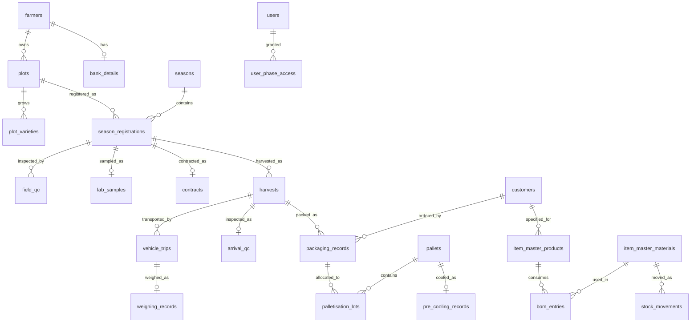

# Reliable Fresh Export Management System — Project Dossier

**Document status:** Draft v1, compiled 2026-09-01
**Compiled from:** discovery notes, client documents, decision history, and working
session records.

> **Important — read this before relying on the document.**
> This draft was assembled without direct access to the repository. It is complete
> and accurate on *decisions, business rules, schema, and history*, because those
> came from the client and from working sessions. It is **incomplete on file:line
> citations, git commit dates, and the directory tree** — every such gap is marked
> `[VERIFY IN REPO]`. Run the companion Claude Code prompt (Appendix A) against the
> codebase to fill them in and produce v2.

---

## 1. What this is

### The client

Reliable Fresh is an agricultural export company based in Pune, Maharashtra, India.
They export table grapes — principally Thompson Seedless, Sonaka, Sharad Seedless,
Flame Seedless and Tas-A-Ganesh — from the Nashik, Sangli and Solapur growing
regions to Europe and the Middle East.

Scale of operation:

| Dimension | Figure |
|---|---|
| Farmers in supply base | ~500 in the Nashik region |
| Farmers under GlobalG.A.P. certificate | 45 grape producers (plus 4 pomegranate) |
| System users | ~12–20 |
| Packhouses | One |
| Pallets per container | ~20–21 |
| Boxes per pallet | 96 or 120 (varies — see §12) |
| Season | December to April |

Named customers: OFD, Roveg, N&K (Rotterdam), FS, MASCL (Saudi Arabia), Boon Kee.
Each has its own packing specification.

### The problem

Before this system, the entire farmer-to-container workflow ran on paper slips,
Excel spreadsheets, and WhatsApp photographs. A weighing slip was a physical carbon
form. A field QC inspection was a handwritten sheet. Traceability from a box in a
Rotterdam warehouse back to the plot it grew on existed only as a chain of paper
that someone had to physically locate.

### Why this matters commercially, not just operationally

Reliable Fresh operates under four overlapping compliance regimes:

- **GlobalG.A.P.** — certificate GGN 4052852773348, covering 45 producers as a
  producer group (Option 2). Valid 2025-06-16 to 2026-03-23.
- **BRCGS Food Safety** — packhouse certification, Grade B, via Varad Vinayak
  Export Pvt Ltd, Nashik. Valid to 14 May 2026.
- **SFDA** (Saudi Food & Drug Authority) — governs the Saudi export route;
  drives the MRL residue testing regime.
- **APEDA / GrapeNet** — the Indian government farm registration scheme that
  issues MH numbers.

Under each of these, traceability is not paperwork for its own sake. A failed audit
or a rejected container costs more than this entire system. The MRL test report
(`RF-35_2025-26`) tests 93 pesticide parameters against SFDA limits; the system must
be able to link a specific test back to a specific plot, variety, and season, and
forward to the boxes that shipped. That linkage is what the system provides.

---

## 2. Origin and timeline

`[VERIFY IN REPO — exact dates from git log]`

| Approx. date | Milestone |
|---|---|
| Pre-2026-08 | Phase 0 discovery. Produced CLAUDE.md, Business_Rules.md (54 rules), Open_Questions.md (14 items), PHASE_MAP.md. Source material: client's `Export_Process_Flow_Chart.xlsx` (14 sheets). |
| 2026-08-11 | CEO answer session. Purchase Order module dropped (no fertilizer purchasing). Palletisation moved to a new Packaging Supervisor role. |
| 2026-08-13 | Three decisive documents received: weighing slip photograph, Container Loading Sheet (RF/54), Lot Creation Format (RF/32). |
| 2026-08-14 | Phase 6 (Weighing) backend complete — 5 files, 3 Alembic migrations applied. |
| 2026-08-22 | Team 2 frontend delivery merged (see below). |
| 2026-08-23 | Phase 6 frontend complete. Team 2 frontend bugs fixed. |
| 2026-08-29 | **Deployment.** Backend live on Render, frontend on Vercel. |
| 2026-08-30 | Cloudinary file storage migration. Founder correction on the rejection rule. |
| 2026-08-31 | **Demo given to the Reliable Fresh CEO.** |
| 2026-09-01 | Authorization overhaul, authentication security audit and fixes, user management. |

### The Team 2 merge — and what it introduced

A second team worked on the frontend in parallel. Critically, **they did not branch
from the current codebase** — they forked from the original pre-Phase-6 state and
worked independently. Their Alembic chain diverged from the same root
(`ee800d0eaf23`) and required a merge revision.

What Team 2 contributed:

- Admin dashboard with KPI cards
- Active Farms list page
- Audit trail viewer, user activity page
- Season registrations list page
- Shared components: `DataTable`, `StatusBadge`, `ProgressCard`, `WorkflowStepper`
- `httpClient` snake_case ↔ camelCase transforms (`toCamel` / `toSnake`)
- Backend: `users.name` column, five user-activity columns, `user_activity` router,
  login/logout tracking

What the merge introduced — and this is the root of an entire bug class covered in
§8 — is that **Team 2 built against mock data, not against the real backend.** Their
frontend called endpoints that had never existed. Because mock mode returned
plausible data, nothing failed until the two halves ran together in production for
the first time. See §8.1.

Team 2 also built a `goodsReceiving` module (packhouse receipt confirmation per
vehicle trip) that appears in no specification and has **no backend at all**. It
remains unresolved — see §11.

---

## 3. How requirements were discovered

Reliable Fresh did not supply a specification. They supplied **documents** — real
export paperwork from live shipments — and the system was reverse-engineered from
them. This turned out to be a far better source than a written spec would have been,
because the documents show what actually happens rather than what someone believes
happens.

### The decisive document: the weighing slip

A WhatsApp photograph of physical weighing slip #937 specified the entirety of
Phase 6. From one image:

- **Tare rate:** 1.6 kg per crate
- **Slip structure:** four columns — A and C are crate counts per group, B and D are
  gross weights per group; two vehicle trips recorded on one slip
- **The arithmetic:** tare = count × 1.6; slip "Gross Weight" = combined post-tare
  net (2,115.2 kg on this slip); rejection = 148.0 kg = 6.997%, i.e. exactly the 7%
  figure; net payable = 1,967.2 kg
- **Every field on the form:** Vehicle No, Vehicle Type, Date, Harvester No, Load Id,
  No. Crt Reci, Knitting, Farmer Name, MH No, GGN No, Village Name, Contact No,
  Grapes/Pomo checkbox, Average Size, Average Sugar, Variety, up to 100 crate
  weights, Gross Weight, Rejection Weight, Net Weight, Remark, slip serial number

Before that photograph, Phase 6 was largely guesswork. After it, the phase was
specified down to the constant. **This is the pattern to repeat** — see §12.

### Full document map

| Document | What it is | Phase it fed | Key data extracted |
|---|---|---|---|
| Weighing slip #937 (photo) | Physical inward vehicle slip | Phase 6 — Weighing | See above. Fully specified the phase. |
| `Container_Loading_Sheet.pdf` (RF/54) | Container packing list, 21 pallets to Rotterdam | Container Loading (unbuilt) | Pallet IDs N-90 to N-112; per-farmer GGN; MH per farm; 5.00 kg box weight; packing date; inventory code (PL); variety; brand; grade CAT-1; package type CLAMSHELL; colour TS2/TS3; count/size L (96 or 120 boxes); target market Europe; container SUDU6290035; seal SSPL40368600; temp 1°C; thermograph 2508293264 linked to pallet N-110 |
| `Lot_Creation_Format.pdf` (RF/32) | Loading sheet grouping farmers by MH number | Bridges Phase 8 → Container Loading | Lot IDs (202681006331, 202623893116) — 12-digit numeric; Consignment ID (020269306762) = AGMARK CAGID; one Lot per farmer-MH entry; fields: Exporter, Packhouse, Invoice No, Container No, Destination, AGMARK Lab name, then rows of Farmer/MH/Boxes/Weight/Total KGS/Metric Tons |
| `RF-35_2025-26_Test_Report.pdf` | MRL lab test report (Envirocare Labs, 5pp) | Phase 3 — Lab Sampling | 93 pesticide parameters, all BLQ except Fluopyram (0.028) and Spirotetramat (0.013); SFDA MRL standard; Thompson Seedless; seal AD-942465; report 01/ETHGR2500451 |
| `Global_Gap_2025-26.pdf` | GlobalG.A.P. certificate (12pp) | Phase 1, Packaging, Packing List | GGN 4052852773348; 45 grape + 4 pomegranate producers; producer group Option 2; individual farmer GGNs listed |
| `RF-64_2025-26__MASCL.pdf` | Proforma invoice, Saudi shipment | Export Docs (unbuilt) | HSN 08061000; 3,744 boxes; 16,848 net kg / 18,720 gross kg; C&F USD 16/box; container MNBU0527947; REX declaration |
| `RF-64_2025-26_COO.pdf` | Certificate of Origin (MACCIA/Nashik) | Export Docs | Exporter/consignee, container, box count, HS code, origin criterion "p" |
| `RF-46_2025-26_COC.pdf` | Certificate of Conformity (Cotecna Saudi, 4pp) | Export Docs | COC format SAU-COC26-*; two line items (Sonaka 2,551 boxes + Black Seedless 900); SFDA standard; Product Registration Numbers per batch |
| `RF-32_2025-26_Fumigation_Cert_.pdf` | Fumigation certificate | Export Docs | Cert SH123-2025-26-0857; Methyl Bromide 48 g/m³, 24 hrs; container MNBU9018961; 21 wooden pallets; ISPM-15 |
| `RF-32_2025-26_Phyato_loading_Sheet.pdf` | Phytosanitary certificate (Govt of India) | Export Docs | PSC160NA202600; 3,744 boxes / 16,848 kg; Vitis vinifera; port Jeddah |
| `RF-32_2025-26_Shipping_Bill.pdf` | Indian customs shipping bill (6pp) | Export Docs, Container Loading | SB 9336450; 2,496 boxes / 14,976 kg; FOB ₹2,804,092.20; drawback 4,206.14; RODTEP 53,664 |
| `RF-32-Seaway_Bill.pdf` | Non-negotiable waybill (Maersk) | Export Docs | B/L 265947057; vessel AL RIFFA 605W; Nhava Sheva → Rotterdam; temp 1.0°C |
| `RF-32_2025-26_Agmark.pdf` | AGMARK grading certificate | Export Docs | Cert AUD/GR/26/0017; RCMC 151580; packhouse Varad Vinayak Export; Class I; CAGID 020269306762 |
| `16560_..._BRCGS_Food_2025_Certificate.pdf` | BRCGS certificate | Company reference | Grade B, valid to 14 May 2026 |
| `RF-54_Sale_Account.pdf` | N&K sales report | Farmer Invoice reference | Lot 17.429; 8% commission; 2,496 boxes; cost breakdown; net payable EUR 7,207.10 |
| `RF-15_2024-25.pdf` | Bank Realisation Certificate (DGFT) | Financial reference | Realised USD 51,000, Axis Bank |
| `QC___Arrival___Report.pdf` | Customer QC report (Sharbatly, Jeddah) | Phase 7 reference | **This is the customer's arrival QC, not ours.** Pomegranates. Quality "Poor", 81% minor defects. |

---

## 4. Decision log

Ordered roughly chronologically. **"Settled by"** distinguishes what the client
confirmed from what we inferred — this distinction matters more than any other in
this document.

### 4.1 Roles are labels; phases are authority

**Decided:** Roles (Admin, Field Worker, Lab Worker, Office Worker, Stock Manager,
Packaging Supervisor) are display names only. Actual authority comes from
per-user phase assignments in `user_phase_access`. Admin can attach any combination
of phases to any user.
**Settled by:** CEO answer (Open Question Q8).
**Consequence:** `users.role` must never be used for a permission check. This was
violated throughout the backend until 2026-09-01 — see §4.10.

### 4.2 One farmer → many plots; one plot → many varieties

**Decided:** Each variety on a plot gets its own independent pipeline — its own
Field QC, Lab Sample, Contract, and Harvest.
**Superseded:** An earlier assumption of one variety per plot.
**Settled by:** CEO answer (Q4, Q15).
**Consequence:** `plot_varieties` table; `season_registrations.plot_variety_id`.
The backend supports this fully. **The frontend has no screen for it** — see §11.

### 4.3 MH registration number — UNRESOLVED

**Current state:** Stored per plot (`plots.mh_registration_number`), unique across
all plots.
**History:** Originally modelled at farmer level. Corrected to per-plot after the
Container Loading Sheet showed distinct MH numbers per farm
(MH06093910801, MH06094254601). A later note then reverted it to per-farmer.
**Settled by:** **Nobody.** This is our inference from a shipping document. No APEDA
registration certificate has ever been seen.
**Status:** `PHASE_MAP.md` currently contradicts itself on this point.
**Cost if wrong:** Column moves from `plots` to `farmers`; plot registration flow
changes; every document that groups by MH changes.
**Resolves with:** One photograph of a farmer's APEDA/GrapeNet certificate.

### 4.4 Rejection percentage — CORRECTED by the founder

**Original reading:** The farmer absorbs rejection up to a 7% cap; the exporter
absorbs anything beyond. Formula: `pay = weight × rate × (1 − min(actual, 7%))`.
**Corrected 2026-08-30:** It is a **flat 7% deduction, not a cap.** The farmer is
**always** paid on 93% of net weight, regardless of what rejection is actually
observed. Actual rejection may be 4% or 9% — it makes no difference to payment.
There is no negotiation and no farmer/exporter split.
**Settled by:** Founder, directly.
**Consequences in code:**
- `FARMER_REJECTION_PCT = Decimal("7")` in `app/core/constants.py`
- `weighing.py` and `packaging.py` both compute from the constant; neither reads the
  contract any more
- `contracts.rejection_percent` is now **dead** — still populated (always 7.00),
  read by nothing computational
- Actual observed rejection is still captured (`actual_rejection_pct` on both
  `weighing_records` and `packaging_records`) as operational data only
- **Note:** those two `actual_rejection_pct` columns are *different measurements* at
  different pipeline stages, from separate inputs

### 4.5 Arrival QC is terminal on fail

**Decided:** One arrival QC per harvest. A failure is final — there is no
re-inspection path.
**Settled by:** Backend design, enforced by a DB unique constraint on
`arrival_qc.harvest_id`, plus `record_arrival_qc` rejecting any second attempt.
**Consequence:** The frontend's "follow-up / re-attempt" flow could only ever return
409 and was removed. `listEligibleHarvests` was also tightened — it previously kept
`Arrival QC Failed` registrations in the picker, letting a worker fill in an entire
inspection that would fail on submit.
**Caveat:** Field QC *does* allow follow-ups (failed rows are kept, R16/R17). The
asymmetry between the two is worth confirming with the client.

### 4.6 Field QC is recorded on the plot screen

**Decided:** No standalone Field QC page. It is recorded together with plot
registration.
**Consequence:** The nav entry was commented out (route and page left in place). The
page it pointed to only said "go to Plots", which read as unfinished.

### 4.7 Purchase Order module dropped

**Decided:** No fertilizer purchasing, no PO process needed.
**Settled by:** CEO, 2026-08-11.
**Consequence:** Router unregistered from `main.py` on 2026-09-01. The router file
remains, unregistered. `purchase_orders` and `purchase_order_line_items` tables
still exist and are slated for removal. Frontend pages exist but no route mounts
them — unreachable dead code.

### 4.8 File storage moved to Cloudinary

**Decided 2026-08-30.**
**Superseded:** Local disk under `backend/uploads/`, served at `/files/...`.
**Why:** Render's free tier has an ephemeral filesystem. Every uploaded file was
wiped on container restart. **Confirmed live** — a passbook photo uploaded that
morning 404'd by evening.
**Consequence:** `save_upload()` rewritten to upload to Cloudinary and return the
secure URL. Signature unchanged, so all four upload endpoints (passbook photo, lab
seal photo, lab documents, weighing slip) were fixed by one change. The `/files`
static mount was removed. Existing DB rows still hold dead `/files/...` paths.

### 4.9 Password and account recovery model

**Decided 2026-09-01:**
- Admin sets names, emails and passwords; users are told their credentials directly
- Admin-set passwords are **permanent** — no forced change at next login
- **No email-based self-service reset.** The Forgot Password link was removed
- A user who forgets contacts the admin, who sets a new password
- Changing a password invalidates that user's existing sessions
- Account recovery is via `scripts/seed_admin.py` as a documented break-glass
  procedure

**Email is functionally a username.** Where a worker has no email, the admin assigns
a plausible one. This is worth knowing because the UI labels it "email" and someone
will eventually expect it to receive mail.

**Outstanding:** A root/break-glass admin credential must be created and handed to
Reliable Fresh in the confidential handover document. **Not yet done.**

### 4.10 Authorization: role-based → phase-based

**Decided 2026-09-01.** See §5.4 for the full model and §9.6 for what changed.

### 4.11 `reports_documents` phase scope

**Decided 2026-09-01, confirmed by the CEO:** This phase holds the **real export
document images** per shipment — fumigation certificate, phytosanitary certificate,
COO, AGMARK, packing list and so on. They attach to specific entities, so clicking a
pallet shows its certificates. Files live in cloud storage. Access is phase-gated.
**Status:** Scope recorded. **No schema designed.** See §12 for the questions that
must be answered first.

---

## 5. Architecture

### 5.1 Stack and hosting

| Layer | Technology | Hosted |
|---|---|---|
| Backend | Python, FastAPI, SQLAlchemy, Alembic | Render (free tier, Oregon) |
| Database | PostgreSQL | Neon (serverless, us-east-2 / Ohio) |
| Frontend | React, TypeScript, Vite, Tailwind | Vercel |
| File storage | Cloudinary | — |
| Auth | JWT (HS256), in-memory token storage | — |
| Uptime | UptimeRobot pinging `/health` every 5 min | — |

The app is a PWA with a service worker (`vite-plugin-pwa`), which has real
consequences — see §8.6.

**Geography is a live performance issue.** Backend in Oregon, database in Ohio,
users in Maharashtra. Every request crosses the Pacific twice. See §10.

### 5.2 Data model

29 tables. Grouped by purpose:

**Identity and access**
- `users` — id, name, email (unique), mobile, password_hash, role, active,
  password_changed_at, last_login_at, last_logout_at, failed_login_count,
  last_failed_login_at, created_at, updated_at
- `user_phase_access` — user_id + phase_key, unique together. 16 phase keys.
- `audit_events` — audit trail

**Permanent records**
- `farmers` — id, name, address, mobile, status (`active`/`inactive`), ggn_number
- `bank_details` — 1:1 with farmer (unique FK), account_holder_name, bank_name,
  account_number, ifsc_code, branch_name, passbook_photo_url
- `plots` — id, farmer_id, plot_number (unique per farmer, R5),
  mh_registration_number (unique globally, nullable), variety, area_acres, village,
  taluka, survey_no, gps_lat, gps_long, pruning_date, approx_harvest_date
- `plot_varieties` — plot_id + variety_name, unique together
- `customers` — id, name (unique), code, is_active
- `seasons` — id, year, start_date, end_date, notes, status, created_by
- `company_settings` — letterhead, GGN, crate tare weight

**The pipeline** (each hangs off `season_registrations`)
- `season_registrations` — **the central state machine.** plot_id, season_year,
  season_id, plot_variety_id, status, registered_by, registered_at. Unique on
  (plot_id, season_year).
- `field_qc` — many per registration (follow-ups allowed). inspection_date,
  planned_sampling_date, tentative_harvest_date, fruit_colour, tss_percent,
  thrips/bhuri/black_spot/cercospora percents, overall_observation,
  exportable_fruit_percent, notes, result, inspected_by
- `lab_samples` — 1:1 per registration. lab_name, sampling_date, seal_no,
  variety_confirmed, area_ha_2a, yield_4b_mt, seal_photo_url, documents_2a4b_url,
  remark, tss_value, result, entered_by
- `contracts` — 1:1 per registration. contract_date, rate_per_kg,
  **rejection_percent (dead — see §4.4)**, created_by
- `harvests` — many per registration. harvest_date, supervisor_name,
  supervisor_contact
- `vehicle_trips` — many per harvest. vehicle_no, driver_name, num_crates,
  approx_weight_kg, crate_count_at_weighing, gross_weight_kg, tare_weight_kg,
  net_fruit_weight_kg
- `weighing_records` — 1:1 per vehicle trip (unique FK). date, slip_no,
  supervisor_name, num_crates, total_weight_kg, rejection_pct, rejection_kg,
  net_weight_kg, slip_photo_url, actual_rejection_pct, slip_serial_no, load_id,
  harvester_no, no_crt_reci, knitting, produce_type, average_size, average_sugar,
  village_name, contact_no, crate_tare_weight_kg
- `arrival_qc` — 1:1 per harvest (unique FK, terminal). inspection_date, fruit colour
  percentages (green/milky/yellow), tss_percent, thrips/bhuri/black_spot/cercospora,
  overall_observation, result, notes, inspected_by
- `packaging_records` — harvest_id, date, slip_no, lot_id (unique), pack_size,
  compliance_type, customer_id, total_weight_kg, rejection_contract_kg,
  net_weight_kg, actual_rejection_kg, actual_rejection_pct, num_boxes, num_pallets,
  ggn_number
- `pallets` — pallet_id (unique string), date, pallet_type, total_boxes, notes,
  status
- `palletisation_lots` — pallet_id + packaging_record_id + num_boxes
- `pre_cooling_records` — pallet_id, date, num_pallets, num_boxes, in_time,
  in_berry_temp, out_time, out_berry_temp

**Inventory**
- `item_master_materials` — material_type, variant_name, unit_of_measure,
  scale_level, reorder_point, is_active
- `item_master_products` — variety, customer_id, pack_size, compliance_type,
  is_active
- `bom_entries` — product_id, material_id, qty_per_container, qty_per_box
- `stock_movements` — material_id, movement_type, quantity, date, supplier_name,
  reference, reason, packaging_record_id

**Dropped**
- `purchase_orders`, `purchase_order_line_items` — router unregistered, tables
  awaiting removal



### 5.3 The status machine

`season_registrations.status` drives the whole pipeline. 13 values:

| Status | Set by |
|---|---|
| `Registered` | Plot registered for the season |
| `Field QC Passed` | Field QC recorded, result Pass |
| `Field QC Failed` | Field QC recorded, result Fail (follow-ups permitted) |
| `Lab Passed` | Lab sample recorded, result Pass |
| `Lab Failed` | Lab sample recorded, result Fail |
| `Under Contract` | Contract created |
| `Harvested (partial)` | Harvest recorded |
| `Weighed` | Weighing record created |
| `Arrival QC Passed` | Arrival QC recorded, Pass — **terminal on fail** |
| `Arrival QC Failed` | Arrival QC recorded, Fail — terminal |
| `Packed` | Packaging record created |
| `Palletised` | Allocated to a pallet |
| `Pre-Cooled` | Pre-cooling record completed |

**Missing:** `Finished Goods QC Passed` / `Failed`. The frontend
`SeasonRegistrationStatus` type has them; **the database enum does not.** The two
disagree, and the backend cannot produce those values. See §11.

Transitions are enforced in `app/services/status_machine.py`, not by the database.
`[VERIFY IN REPO — the exact legal transition table]`

### 5.4 The phase permission model

16 phases:

`farmer_registration`, `plot_registration`, `field_qc`, `lab_sampling`,
`farmer_contract`, `harvesting`, `weighing`, `arrival_qc`, `packaging`,
`inventory_management`, `palletisation`, `pre_cooling`, `finished_goods_qc`,
`admin`, `users`, `reports_documents`

Two dependencies gate every endpoint:

- `require_phase(phase, ...)` — actor must hold one of the named phases
- `require_any_phase()` — actor must hold at least one phase. Used for shared
  reference reads (`/plots`, `/farmers`, `/registrations`) that nearly every
  feature joins against. Deliberately open; narrowing them would break
  cross-feature joins.

**Tight gating** is applied where data is genuinely sensitive:
`GET /farmers/{id}/bank-details` → `{farmer_registration, farmer_contract}`;
`GET /contracts` → `{farmer_contract}`; and per-phase gating on everything else.

#### The `users` phase — the security boundary

A holder of `users` can manage non-admin users. Five rules, enforced in
`app/services/user_admin_guard.py`, **on the backend, not just by hiding UI**:

1. Can create, edit, deactivate and assign phases to non-admin users
2. **Cannot** grant any phase to themselves (nor remove their own)
3. **Cannot** grant the `users` phase to anyone — only admin can
4. **Cannot** view, edit, deactivate or change phases on any admin account. Admin
   rows are *filtered out of the list entirely*, not shown-but-disabled
5. Admin always holds all phases and cannot have any removed — prevents locking
   everyone out of user management

Two further guards added during implementation:
- **Cannot promote anyone to `role: admin`** — without this, a `users` holder could
  grant themselves admin (and thus all phases) through the `role` field, bypassing
  rule 3 entirely
- **Cannot deactivate the last remaining active admin**

Admin protection keys off `PhaseKey.ADMIN in phases`, **not** the role label —
consistent with §4.1, and it closes the hole where a mislabelled account holding the
admin phase would be editable.

### 5.5 Authentication

| Aspect | Implementation |
|---|---|
| Password hashing | bcrypt via passlib, cost factor 12 |
| Minimum length | 12 characters (raised from 8) |
| Token type | JWT HS256, `sub` / `exp` / `iat` / `type` claims |
| Access token | ~30 minutes |
| Refresh token | 7 days, **not rotated** |
| Token storage | In-memory only (React state / module variable). Never localStorage. |
| `SECRET_KEY` | Required env var, **no hardcoded fallback**, never in git history |
| Algorithm | Pinned via explicit allowlist. `alg:none` and mismatched algorithms rejected — verified adversarially |
| Deactivation | Checked on **every request**, not just login |
| Revocation | `password_changed_at` compared against token `iat`. Kills access *and* refresh tokens instantly. |
| Login lockout | 5 failed attempts → 15 minute lockout. Admin can clear. |
| Timing | Equalised — dummy bcrypt verify + matching no-op UPDATE on the nonexistent-email path |
| CORS | Pinned to `FRONTEND_ORIGINS` env var |

**Session handling on the frontend:** a 401 triggers one refresh attempt, then
retries the original request. If the refresh fails, the session is cleared, a toast
shown, and the user redirected to login. Concurrent 401s de-duplicate to a single
refresh call and a single toast. A `password_changed` error code skips the refresh
attempt entirely, since the refresh token from that session is structurally
guaranteed to fail too.

---

## 6. Project structure

`[VERIFY IN REPO — this section is reconstructed from conversation and is the least
reliable part of this document. Have Claude Code regenerate it from an actual
directory listing.]`

### Backend — 19 routers

| Router | Owns |
|---|---|
| `auth.py` | login, refresh, logout |
| `users.py` | user CRUD, `/me` |
| `user_activity.py` | activity log (admin) |
| `audit_log.py` | audit trail (admin) |
| `seasons.py` | season management |
| `customers.py` | customers, company settings |
| `farmers.py` | farmers, bank details, passbook photo, fuzzy search |
| `plots.py` | plots, season registrations, field QC |
| `plot_varieties.py` | per-plot variety list |
| `contracts.py` | contracts |
| `lab_samples.py` | lab samples, seal photo, 2A/4B documents, lab queue |
| `harvests.py` | harvests |
| `weighing.py` | vehicle trips, weighing records, slip photo |
| `arrival_qc.py` | arrival QC |
| `packaging.py` | packaging records |
| `palletisation.py` | pallets, lot allocation |
| `pre_cooling.py` | pre-cooling records |
| `inventory.py` | materials, products, BOM, stock movements, alerts, order calculator |
| `purchase_orders.py` | **unregistered — out of scope** |

Other backend directories: `app/models/`, `app/schemas/`, `app/services/`
(`status_machine.py`, `inventory.py`, `audit_service.py`, `user_admin_guard.py`),
`app/core/` (`config.py`, `deps.py`, `security.py`, `enums.py`, `constants.py`),
`app/db/`, `app/utils/` (`file_upload.py`, `indian_words.py`), `scripts/`
(`seed_admin.py`, `seed_users.py`), `alembic/`.

### Frontend conventions

Each feature under `src/features/<name>/` follows the same shape:

```
features/<name>/
  api.ts          real API calls via httpClient
  api.mock.ts     mock implementation for offline UI dev
  types.ts        TypeScript types for this feature
  hooks.ts        React Query hooks
  schema.ts       Zod validation schemas
  pages/          route components
  components/     feature-specific components
```

Shared: `src/api/httpClient.ts` (fetch wrapper, auth interceptor, case transforms),
`src/api/transforms.ts`, `src/app/AuthContext.tsx`, `src/app/ToastContext.tsx`,
`src/components/` (layout, forms, data, feedback, workflow, icons),
`src/routes/routeConfig.tsx`, `src/routes/navConfig.ts`, `src/permissions/`,
`src/utils/errorMessages.ts`, `src/styles/tokens.css`.

**Important convention:** the mock API layer deliberately does **not** replicate
`user_admin_guard`'s rules. The security boundary is backend-only by design;
keeping a second copy in sync would be its own risk.

---

## 7. The pipeline, phase by phase

| # | Phase | Backend | Frontend | Notes |
|---|---|---|---|---|
| 1 | Farmer registration | ✅ | ✅ | Includes bank details, passbook photo, fuzzy duplicate search |
| 2 | Plot registration + Field QC | ✅ | ✅ | Field QC recorded on the plot screen; standalone nav entry removed |
| — | Plot varieties | ✅ | ❌ | **Full backend, no screen.** Multi-variety is a confirmed rule. |
| 3 | Lab sampling | ✅ | ✅ | Seal photo + 2A/4B document upload |
| 4 | Farmer contract | ✅ | ✅ | `rejection_percent` now dead |
| 5 | Harvesting | ✅ | ✅ | Multiple harvests per registration |
| 6 | Weighing | ✅ | ✅ | Fully specified by the slip photo. Print view exists. **Redesign to match the paper form is outstanding.** |
| 7 | Arrival QC | ✅ | ✅ | Terminal on fail |
| 8 | Packaging | ✅ | ✅ | **Missing columns** — see §11 |
| 9 | Inventory management | ✅ | ✅ | Materials, products, BOM, stock, alerts, order calculator |
| 10 | Palletisation | ✅ | ✅ | Now gated on the `palletisation` phase |
| 11 | Pre-cooling | ✅ | ✅ | Phase assignment provisional pending Q9 |
| 12 | ~~Purchase Order~~ | — | — | **Dropped.** Router unregistered. |
| 13 | Finished Goods QC | ❌ | ❌ | **Nothing exists.** No table, no fields, no status values. Blocked on the CEO's format document. |
| — | Goods Receiving | ❌ | ✅ | Team 2 built a frontend for a module that is in no spec and has no backend |
| — | Container Indent | ❌ | ❌ | Unscoped |
| — | Container Loading | ❌ | ❌ | Partly specified by RF/54 and RF/32 |
| — | Farmer Invoice | ❌ | ❌ | Blocked on seeing a real payment statement |
| — | Export Documents | ❌ | ❌ | Scope now confirmed (§4.11), schema not designed |

---

## 8. Things that broke, and what we learned

This section will save the next person the most time. Each entry is a *class* of
bug, not a single incident.

### 8.1 The frontend called endpoints that never existed

**Symptom:** 405 Method Not Allowed, intermittently, on some pages. Elsewhere,
"No plots are ready for lab sampling" on a queue that should have had four entries.

**Actual cause:** Team 2 built against mock data. The mock layer never checks whether
an endpoint is real — write `httpClient.get('/plots/1')` and the mock happily
returns something. The real backend had `PATCH /plots/{id}` but no `GET`. FastAPI
therefore returned **405, not 404** — "this path exists, but not for that method" —
which read like a CORS or routing problem rather than "this endpoint was never
built."

**Why nothing caught it:** TypeScript can't check a URL string. Backend tests covered
the endpoints that existed, not the ones someone expected. And because the Vercel
deploys were blocked (§8.7), the combined app had never actually run against the real
backend until the day it broke.

**Structural fix:** A full API contract audit — fetch `openapi.json`, list every
`httpClient` call in the frontend, diff the two. Found three broken endpoints and
one entirely missing module. The audit is repeatable and should be re-run whenever
the two halves diverge.

### 8.2 Failed requests looked like empty results

**Symptom:** "No plots are ready for lab sampling" when the real problem was a 405.
Elsewhere, a completely white page.

**Actual cause:** Components destructured only `{ data, isLoading }` from React Query.
A failed query leaves `data` as `undefined`, and `(data?.length ?? 0) === 0` renders
the empty state — indistinguishable from a genuinely empty queue. Where nothing
caught the error at all, it escaped during render and blanked the page.

**Why it cost days:** the failure mode was *plausible*. "No plots are ready" is a
sentence a user believes.

**Structural fix:** Swept the entire frontend twice. Ten sites fixed. `isError`
now renders a real `ErrorState` with retry; `EmptyState` only shows on a genuine
empty success. A React error boundary wraps the route tree.

**The rule worth carrying forward: a failed request must never look like a
successful empty one.**

### 8.3 Status strings compared in the wrong case

**Symptom:** Every "pending" card on the admin dashboard read zero, while the
individual pages showed correct data.

**Actual cause:** The dashboard filtered on `'field_qc_passed'`. The database enum
value is `'Field QC Passed'` — spaces, capitals. Never matched, so every count was
zero. A second bug in the same screen counted distinct `plot_number` *strings*
instead of distinct plots — and since plot numbers are only unique per farmer, 17
plots collapsed to 4.

**Structural fix:** All comparisons now use typed `SeasonRegistrationStatus[]` arrays
rather than bare strings, so a typo is a compile error. `workflowSteps.ts` had done
this correctly all along and is the model to follow.

### 8.4 N+1 request patterns, copy-pasted across six modules

**Symptom:** Pages past Harvests took many seconds to load and save.

**Actual cause:** `loadAllHarvestsWithContext` looped every registration making three
serial requests each. With 16 registrations that is ~50 sequential round-trips to a
free-tier backend on another continent. The pattern had been copy-pasted into
arrivalQc, harvests, packaging, palletisation, contracts and plots.
Worst case: `palletisation`'s `farmerNameForHarvest` re-fetched *all* registrations
on every call, inside two separate loops — N×M, not N+1.

**Structural fix:** Bulk-fetch `/plots` and `/farmers` once, join in memory,
`Promise.all` anything genuinely per-row. Sweep confirmed **zero remaining
`await`-inside-a-loop sites** across `src/`.

### 8.5 Files written to an ephemeral filesystem, silently lost

**Symptom:** None. That's the point. The upload succeeded, the database recorded a
path, the UI showed success — and days later the file was gone.

**Actual cause:** Render's free tier wipes local disk on every container restart.
`save_upload()` wrote to `backend/uploads/`.

**Structural fix:** Cloudinary (§4.8). And a broader lesson: the passbook photo had a
*second* silent-loss bug alongside it — the frontend folded the `File` into a JSON
body where it simply vanished, because `POST /farmers/{id}/bank-details/photo`
existed and was never called.

**Silent data loss is worse than a white screen.** A white screen tells you
something is wrong.

### 8.6 A service worker served stale bundles

**Symptom:** Fixes were deployed, Vercel was green, and the browser still ran old
code. Hours lost debugging a bug that had already been fixed.

**Actual cause:** The app is a PWA. The service worker intercepts requests and serves
its cached bundle before the network is consulted. Even Ctrl+Shift+R doesn't
reliably beat it.

**Structural fix:** None available in code — this is inherent to service workers.
**The habit:** keep "Update on reload" ticked under DevTools → Application → Service
Workers while developing, and check there *first* whenever a deploy appears not to
have worked.

### 8.7 A git commit email blocked every deployment

**Symptom:** The logo and theme never appeared on the live site, despite being
correctly in the code and pushed.

**Actual cause:** Commits were stamped `bt23f06f042@gmail.com`. The GitHub account
holds `bt23f06f042@geca.ac.in` — same username, different domain. Vercel refused to
build from an unrecognised author and kept serving the last successful build. Every
deploy since the redesign had silently failed.

**Structural fix:** Corrected `git config user.email`. **Check the Deployments tab
before assuming a code problem.**

### 8.8 Stale database connections after Neon idle-suspend

**Symptom:** Intermittent 500s on the first request after a quiet period.

**Actual cause:** Neon suspends compute when idle and drops connections. SQLAlchemy
handed out a pooled connection without checking it was alive. `psycopg2` failed with
`SSL connection has been closed unexpectedly`.

**Structural fix:** `pool_pre_ping=True`. `pool_recycle` was tested and **rejected** —
measurement showed a forced reconnect costs ~1.3s unconditionally, whether or not
the connection was actually dead. Additionally, `/health` now runs a real query, so
UptimeRobot's existing 5-minute ping keeps Neon warm and the pre-ping rarely has to
do anything. As a bonus, the health check now fails honestly when the database is
down, instead of always reporting "ok".

### 8.9 A CORS mismatch that looked like an unreachable server

**Symptom:** First login of every session failed with "couldn't reach server"; the
second attempt worked immediately.

**Actual cause:** The browser sends a preflight OPTIONS request before a
cross-origin call. When it fails, the browser reports it to JavaScript as a plain
network error with no status code — indistinguishable from an unreachable server.
The second attempt worked because the browser caches the preflight result.

`FRONTEND_ORIGINS` was not set in Render, so the backend rejected the real Vercel
origin.

**Structural fix:** Set `FRONTEND_ORIGINS`. **And a debugging lesson:** the Fetch/XHR
filter in DevTools *hides* OPTIONS requests, which is why the failing preflight was
never visible. Use the "All" filter when investigating anything CORS-shaped.

### 8.10 Uncaught constraint violations became bare 500s

**Symptom:** Creating a plot with a duplicate MH number returned 500 "Something went
wrong."

**Actual cause:** `create_plot` explicitly handled farmer-not-found and duplicate
plot-number, but not duplicate MH number. The `IntegrityError` escaped uncaught.

**Structural fix:** Global exception handlers in `main.py`:
- `IntegrityError` → 409, with a lookup table mapping real constraint names (queried
  from `pg_constraint`, not guessed) to human sentences
- Catch-all `Exception` → 500 with a short generated error id, logged server-side
  with the full traceback. A user can report "error 7f3a2b" and the exact traceback
  is findable.

Plus explicit prechecks where a better message is possible.

---

## 9. Work completed 2026-08-29 → 2026-09-01

### 9.1 API contract audit
Fetched live `openapi.json`, diffed against every frontend `httpClient` call.
**Found:** `GET /plots/{id}` and `GET /farmers/{id}` missing (added);
`GET /farmers/{id}/bank-details` missing (added, 404 on absence — deliberately, so
the frontend can distinguish "no bank details yet" from "request failed"); the entire
`goods-receiving` module has no backend. Also found `GET /lab-samples/queue` existing
and unused while the frontend looped over per-plot calls instead.
**State:** Complete.

### 9.2 Empty-state and white-screen sweeps
Two passes. Ten sites fixed across labSamples, contracts, farmers, packaging,
goodsReceiving, itemMaster, preCooling, palletisation, harvests and companySettings.
Highest-severity finds: `BankDetailsPage` and `CompanySettingsPage` both rendered an
editable blank form on a failed load — and both submit a PUT upsert, so submitting
would have overwritten real data with blanks.
**State:** Complete. Sweep confirms zero remaining.

### 9.3 N+1 fixes
Six modules. See §8.4. **State:** Complete, zero remaining sites.

### 9.4 Cloudinary migration
See §4.8. **State:** Complete and verified — files now survive container restarts.

### 9.5 Dashboard fixes and data seeding
Status-string casing, the plot-count collision, and query-param drill-through on the
registrations list. Database seeded with 10 farmers, 16 plots, 17 registrations
spread across every pipeline stage, plus contracts, harvests, weighing, packaging,
pallets, pre-cooling, item master, BOM and stock movements.
**State:** Complete.

### 9.6 Authorization overhaul
The largest change of the period. Before: `user_phase_access` was written but never
read as an access check. Role gates existed on most writes, inconsistently. **Nearly
every GET was guarded only by "is logged in"** — including
`GET /farmers/{id}/bank-details`, which returns account numbers and IFSC codes.

Any authenticated user of any role could read the entire dataset.

Applied: `require_phase` and `require_any_phase` added; every read and write across
19 routers converted; `plot_varieties`' three endpoints (including a destructive
DELETE) gated for the first time; `purchase_orders` unregistered;
`palletisation`'s `OFFICE_WORKER` gate corrected to the `palletisation` phase, with a
Packaging Supervisor account seeded so the capability isn't orphaned.
**State:** Complete, verified with real accounts and real tokens.

### 9.7 Authentication security audit and fixes
| Finding | Severity | State |
|---|---|---|
| Login timing gap (1.6s, measured) enabling email enumeration | HIGH | Fixed — equalised, re-measured |
| No rate limiting on login | HIGH | Fixed — 5 attempts, 15 min lockout |
| No token revocation | MEDIUM | Fixed — `password_changed_at` vs `iat` |
| No refresh rotation | MEDIUM | **Deliberately not done** — `password_changed_at` already provides a kill switch; rotation adds theft *detection* at real risk to multi-tab use |
| CORS wildcard with credentials | MEDIUM (landmine) | Fixed — pinned to `FRONTEND_ORIGINS` |
| 8-char password minimum | LOW | Fixed — 12 |
| bcrypt cost 12, algorithm pinning, `exp` verification, deactivation checked per-request, no secrets in git | — | **Already correct.** Verified adversarially. |

### 9.8 User management and the `users` phase
Full CRUD, mobile column, editable name/email/password/phases, last-login column,
deactivate-not-delete, lockout clearing, Forgot Password removed. `users` and
`reports_documents` added to `PhaseKey`. Guard rules per §5.4.
**State:** Complete, all boundary rules manually verified.

### 9.9 Connection pooling and health check
See §8.8. **State:** Complete.

### 9.10 Session expiry handling
See §5.5. **State:** Applied; backend half live-verified. **Frontend behaviour in a
real browser is not yet confirmed** — needs a manual pass.

---

## 10. Current state

**Deployed and working end to end:** phases 1 through 11. Farmer registration
through pre-cooling, plus inventory management and item master.

**Hosting:** backend on Render (free), database on Neon, frontend on Vercel, files on
Cloudinary, uptime monitoring via UptimeRobot.

**Seeded test data:** 10 farmers (1 inactive), 16 plots, 17 season registrations
across every status, 4 customers, 14 materials, 8 product combinations, BOM for
three products, stock movements including one negative adjustment.

**Test accounts:**

| Email | Password | Phases |
|---|---|---|
| admin@reliablefresh.com | *(changed — see note)* | All 16 |
| fieldworker@reliablefresh.com | `Field@123` | farmer_registration, plot_registration, field_qc, harvesting, weighing, arrival_qc |
| labworker@reliablefresh.com | `Lab@123` | lab_sampling |
| officeworker@reliablefresh.com | `Office@123` | farmer_registration, farmer_contract, packaging |
| stockmanager@reliablefresh.com | `Stock@123` | inventory_management, packaging, pre_cooling |
| packagingsupervisor@reliablefresh.com | `Packaging@123` | palletisation, pre_cooling |

> ⚠️ These are hardcoded in `scripts/seed_users.py`, committed to git, and all under
> the new 12-character minimum. They work for login (validation is on write) but
> cannot be re-set to those values. **Change before real users arrive.**

### Known limitations

1. **Geography.** Backend in Oregon, database in Ohio, users in Maharashtra. Every
   request crosses the Pacific twice — roughly 300–500ms of pure latency before the
   server does any work. This is now the dominant cost. Moving Render to Singapore
   would halve the user-facing hop but worsen the backend↔database hop; doing it
   properly means moving both.
2. **Render free tier.** Spins down after 15 minutes idle. UptimeRobot mitigates it.
3. **Service worker.** Will serve stale bundles during development (§8.6).
4. **No refresh token rotation** (deliberate — see §9.7).

---

## 11. What remains

### Ranked by cost if we've guessed wrong

**Tier 1 — a wrong assumption forces a schema migration**

| Item | Why |
|---|---|
| **MH number placement** | Currently per-plot, from inference only. Wrong → column moves table, plot registration changes, every MH-grouped document changes. Resolves with one APEDA certificate. |
| **Finished Goods QC** | No table, no fields, no status enum values. The frontend type already has statuses the DB cannot produce. Blocked on the CEO's format document. |
| **Farmer Invoice** | Entirely unscoped. We have money coming *in* (N&K sales account); nothing showing what is paid *out*. |
| **`reports_documents` schema** | Scope confirmed, design not started. Four questions must be answered first (§12). |

**Tier 2 — format mismatches, invisible until reconciliation**

| Item | Why |
|---|---|
| **Pallet ID format** | Client uses `N-90`…`N-112`. Our generator produces something else. Nothing errors; the paperwork simply won't match. |
| **Lot ID format** | Client uses 12-digit numeric (`202681006331`). Ours differs. |
| **Consignment ID** | Appears to be the AGMARK CAGID — externally issued. If so, the system should *capture* it, not generate it. |

**Tier 3 — missing fields and modules**

| Item | Detail |
|---|---|
| `packaging_records` missing columns | No package type (CLAMSHELL), grade (CAT-1), brand, colour code (TS2/TS3), count/size (L), inventory code (PL), or target market — all printed on RF-54 |
| Pallet capacity assumed fixed | RF-54 shows both 96 and 120 boxes; code likely assumes 120 |
| Invented enums | `overall_observation` (Good/Very Good/Excellent), `pallet_type` (Big/Mini), the ten `material_type` values — no document supports any of these |
| `plot_varieties` frontend | Full backend, properly gated, **no screen at all** |
| Goods Receiving backend | Frontend exists, no backend, in no spec. Decide scope; hide the nav entry meanwhile. |
| Container Indent, Container Loading, Export Documents | Unscoped or partly scoped |

**Tier 4 — technical debt and polish**

- Toast sweep — several actions succeed or fail with no user feedback (the
  "use this location" case is one; a full sweep is needed)
- Collapsing sidebar
- Inventory nav grouping (dashboard, materials, BOM under one parent)
- Weighing slip redesign to match the client's paper form — **high client value, and
  the specifying photograph already exists**
- Move hosting closer to India
- Seeded passwords out of committed code
- `purchase_orders` tables removal
- `PHASE_MAP.md` self-contradiction on the MH number
- Frontend session-expiry behaviour needs a manual browser test
- **Root/break-glass admin credential must be created and handed over** — not yet
  done

---

## 12. Open questions for the client

Ranked by what a wrong guess costs. The most efficient request is not a list of
questions but **one blank copy of every paper form still in use, plus one completed
example of each.** The weighing slip photograph specified an entire phase; a blank
arrival QC form and a blank Finished Goods QC form would likely do the same.

| # | Ask for | Unblocks | Why it matters |
|---|---|---|---|
| 1 | **Finished Goods QC form** — photo of the blank form. Plus: what happens to a failed pallet? | Phase 13 | Nothing can be built without it |
| 2 | **APEDA / GrapeNet certificate** — photo of one farmer's | MH number placement | Settles §4.3 definitively |
| 3 | **A farmer payment statement** — one completed | Farmer Invoice module | We have nothing showing money paid out |
| 4 | **Pallet numbering** — where does `N-90` come from? Pre-printed, hand-written, or system-assigned? Does it reset per container or run through the season? | Palletisation | Format mismatch, invisible until reconciliation |
| 5 | **Box label / sticker** — photo showing all printed codes. Does the 12-digit lot ID encode anything? | Packaging, traceability | Same |
| 6 | **Consignment ID** — who issues it, and when? | Container Loading | Determines generate vs. capture |
| 7 | **Blank packing list** + the full value list for package type, grade, brand, colour, count/size, inventory code, target market. **Specifically:** is TS2/TS3 the same judgement as our Green/Milky Green/Yellow field QC colour, or a separate packing-stage assessment? | Packaging, Container Loading | Seven missing columns |
| 8 | **Boxes per pallet** by box size and pallet type | Palletisation | Code assumes a fixed number |
| 9 | **Blank field QC and arrival QC forms** | Inspection vocabulary | Confirms or corrects three invented enums at once |
| 10 | **Export document attachment rules** (Q15): which entity does each document type attach to — pallet, container, or shipment? One per type or many? Who uploads them? Before or after shipping? | `reports_documents` | Cannot design the schema without these |
| 11 | **Pre-cooling ownership** (Q9): office worker, stock manager, or packaging supervisor? | Phase 11 gating | Currently provisional |
| 12 | **Arrival QC asymmetry**: Field QC permits follow-ups after a failure; Arrival QC is terminal. Is that intentional? | Phase 7 | Enforced by a DB constraint; reversing means a migration |

---

## Appendix A — Prompt to complete this document from the repo

Run this in Claude Code from the repo root to fill the `[VERIFY IN REPO]` gaps:

```
docs/PROJECT_DOSSIER.md exists as a draft compiled without repo access.
It is accurate on decisions, business rules, schema and history, but has
gaps marked [VERIFY IN REPO]. Complete it into v2.

Specifically:

1. Section 2 (timeline) — replace approximate dates with real ones from
   git log, and add any milestones the draft missed.

2. Section 5.3 — add the actual legal transition table from
   app/services/status_machine.py, as code, not prose.

3. Section 6 (project structure) — regenerate entirely from a real
   directory listing of both halves. The draft version is reconstructed
   from memory and is the least reliable part of the document. Annotate
   every router, service and feature directory.

4. Throughout — add file:line citations wherever the draft makes a
   specific claim. Where a claim turns out to be wrong, correct it and
   say so explicitly rather than silently editing.

5. Verify the table and column lists in Section 5.2 against the actual
   models. Flag anything the draft got wrong or missed.

6. Section 11 — add file:line references to every technical debt item.

Do not remove content. Do not soften a finding because it is
uncomfortable. Where the draft says something is unresolved or
inferred, keep it that way unless you find evidence in the repo that
settles it — and if you do, cite the evidence.
```

---

## Appendix B — Debugging habits earned the hard way

1. **A failed request must never look like a successful empty one.** This single
   confusion cost more time than any actual bug in the project.
2. **405 means the path exists but not for that method.** 404 means the path doesn't
   exist. The distinction tells you whether to fix the frontend or the backend.
3. **Check DevTools → Application → Service Workers before assuming a deploy
   failed.** The PWA will serve stale code indefinitely.
4. **Check the Vercel Deployments tab before assuming a code problem.** A blocked
   deploy looks exactly like a bug that won't fix.
5. **Use the "All" filter in the Network tab for CORS issues.** Fetch/XHR hides
   OPTIONS preflights, which is where the answer lives.
6. **Measure, don't assume, when latency is involved.** Interleave samples — Neon's
   latency swings enough to invert a naive before/after comparison.
7. **Silent data loss is worse than a crash.** A white screen tells the user
   something is wrong. A file that vanishes tells them nothing.
